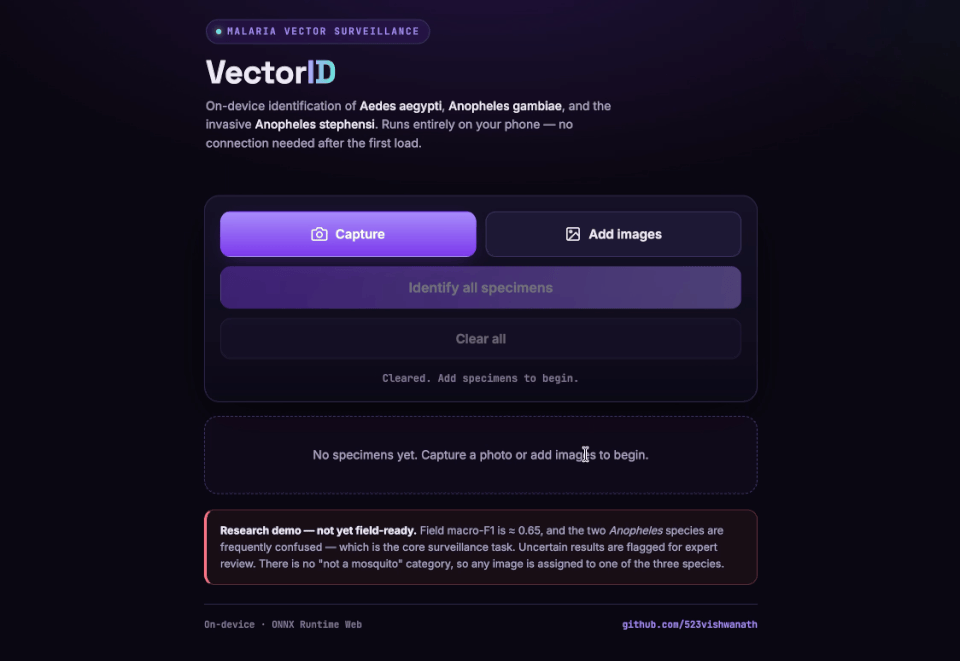
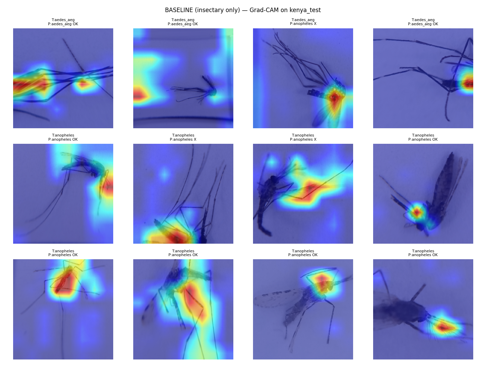
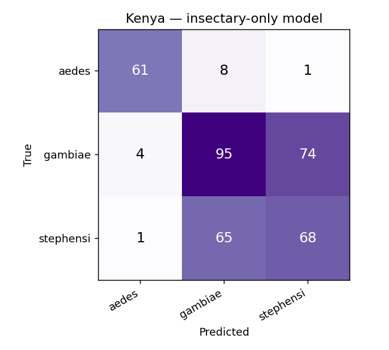
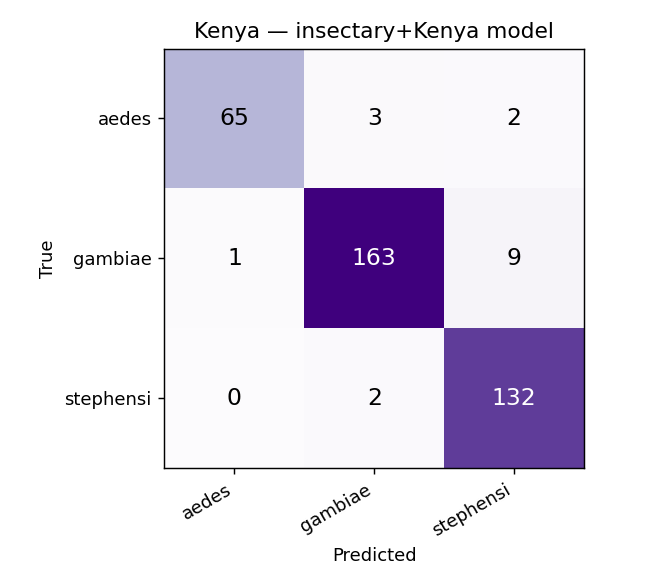
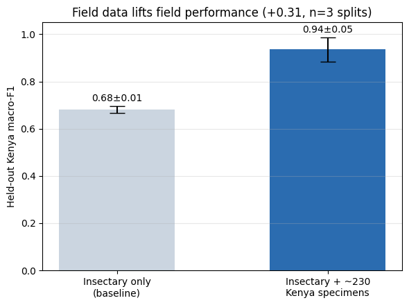

# VectorID — A Field-Deployable Mosquito Species Classifier

A phone tool that looks at a photo of a mosquito and tells you which of three species it is: *Aedes aegypti*, *Anopheles gambiae*, or the invasive *Anopheles stephensi*. Built for malaria vector surveillance in Kenya, where it needs to run on cheap phones with little or no internet.

> **The honest bottom line:** on real Kenya field photos the model scores **0.65 (macro-F1)** — not good enough to deploy this quarter. But I found *why*, and the fix is clear: the problem is missing field data, not the model. Adding a small amount of Kenya data to training raises the field score by **+0.31**. Full reasoning in **[WRITEUP.md](WRITEUP.md)**.

**Author:** Vishwanath Ninganolla · [GitHub](https://github.com/523vishwanath) · [LinkedIn](https://linkedin.com/in/vishwanathninganolla)

**Try the live app:** **[523vishwanath.github.io/vectorid-ondevice](https://523vishwanath.github.io/vectorid-ondevice/)** (runs on your phone, works offline)



---

## Table of contents

1. [The problem](#1-the-problem)
2. [A one-minute guide to the metrics](#2-a-one-minute-guide-to-the-metrics-read-this-first)
3. [Results at a glance](#3-results-at-a-glance)
4. [The dataset](#4-the-dataset)
5. [How the data was cleaned](#5-how-the-data-was-cleaned)
6. [How the evaluation was set up](#6-how-the-evaluation-was-set-up)
7. [Error analysis — the story of how I found the real problem](#7-error-analysis--how-i-found-the-real-problem)
8. [The proof that data closes the gap](#8-the-proof-that-data-closes-the-gap)
9. [The model and edge deployment](#9-the-model-and-edge-deployment)
10. [The live app](#10-the-live-app-vectorid)
11. [System architecture](#11-system-architecture)
12. [Limitations and next steps](#12-limitations-and-next-steps)
13. [Reproducing the results](#13-reproducing-the-results)
14. [Tools used](#14-tools-used)
15. [Repository structure](#15-repository-structure)

---

## 1. The problem

Malaria control depends on knowing which mosquito species are in a given place. Normally that means sending specimens to a lab and waiting weeks for a trained expert to identify them under a microscope. The goal here is to replace that slow loop with a phone: a field officer photographs a mosquito and gets an answer on the spot.

The most important job is spotting **Anopheles stephensi**, an invasive species spreading through Africa. It looks almost identical to the common **Anopheles gambiae**, but it needs a different control response — so telling the two apart is the whole point. A third species, **Aedes aegypti**, is also caught in the same traps and included.

**The central question this project answers:** can we build a classifier reliable enough to deploy in Kenya, and is it ready this quarter — yes or no?

---

## 2. A one-minute guide to the metrics (read this first)

Every number in this project is a specific kind of measurement. Here is what they mean, in plain terms.

**Accuracy** is the simplest one: out of all the photos, what fraction did the model get right? The problem: if 70% of the photos are gambiae, a lazy model that *always* guesses "gambiae" scores 70% accuracy while being useless. So accuracy can hide a bad model when the classes are unbalanced — which is exactly our situation (Kenya is about two-thirds gambiae).

**Precision** answers: when the model says "stephensi," how often is it actually stephensi? (High precision = few false alarms.)

**Recall** answers: out of all the real stephensi, how many did the model catch? (High recall = few missed cases.)

**F1 score** combines precision and recall into one number between 0 and 1. It is high only when *both* are high — the model must catch the real cases *and* not raise false alarms. An F1 of 1.0 is perfect; 0.5 is weak; below 0.5 is barely better than guessing.

**Macro-F1** is the F1 score calculated separately for each of the three species, then averaged so every species counts equally. This is the main number I report, because it stops a model from hiding a failure on the rare, important species (stephensi) behind success on the common one (gambiae). **When you see a number in this project, it is macro-F1 unless I say otherwise.**

So when I write "the model scores 0.65 on Kenya," I mean: **macro-F1 of 0.65** — the average, class-balanced F1 across all three species on real Kenya field photos. That is the honest field-performance number this whole project is built to defend.

---

## 3. Results at a glance

All numbers below are **macro-F1** (see the guide above).

| Evaluation | Macro-F1 | What it tells us |
|---|---|---|
| Validation (lab photos, held-out specimens) | 0.99 | The model learns the lab easily |
| Test A — unseen phones (drop 0623) | 0.92 | It handles new camera models well |
| **Test B — Kenya field photos** | **0.65** | **The real deployment number** |
| Kenya, after adding field data to training | 0.96 | The fix works: +0.31 improvement |

The **0.65** is the number I stake the recommendation on. It comes from a model that never saw a single Kenya photo during training, tested on all the Kenya photos — a true "first day in the field" test. The **0.96** comes from a controlled experiment (below) showing what happens when the model *does* get to learn from field data.

---

## 4. The dataset

Four data batches ("drops") were provided, assembled by different people on different phones across several months.

| Drop | Source | Images | Specimens | Notes |
|---|---|---|---|---|
| 0610 | Insectary (lab) | 1,686 | 71 | Lab-reared, controlled conditions |
| 0618 | Insectary (lab) | 2,618 | 97 | Lab-reared, controlled conditions |
| 0623 | Insectary (lab) | 422 | 62 | **Two new phone models** — used to test new devices |
| kenya_01 | **Field (Kenya)** | 753 | 461 | Real field-caught specimens — the deployment test |

After cleaning: **5,479 images across 691 specimens.**

**How the data splits into train / validation / test:**

| Split | Drops | Images | Specimens | Purpose |
|---|---|---|---|---|
| Training | 0610 + 0618 | 3,434 | 134 | Teaches the model |
| Validation | 0610 + 0618 (held-out specimens) | 870 | 34 | Tunes and picks the best model |
| **Test A** | 0623 | 422 | 62 | Checks it works on unseen phones |
| **Test B** | kenya_01 | 753 | 461 | Checks it works in the real field (the number that counts) |

Note how many specimens each drop has: the lab drops photograph each specimen ~20 times, so 168 lab specimens make 4,304 images. Kenya photographs each specimen only ~1.6 times, so 461 specimens make just 753 images. This difference matters for how the data is split (explained below).

**The single most important pattern in the data — the "condition reversal."** Every specimen was photographed either **fresh** (just caught) or **dried** (preserved). When I counted these, a striking problem appeared: for *every* species, the lab and Kenya used *opposite* conditions.

| Species | In the lab (training) | In Kenya (testing) |
|---|---|---|
| *Aedes aegypti* | 1,767 fresh / 0 dried | 0 fresh / 146 dried |
| *An. gambiae* | 666 fresh / 972 dried | 326 fresh / 0 dried |
| *An. stephensi* | 1,321 fresh / 0 dried | 0 fresh / 266 dried |

Read that table carefully: the model learns *fresh* stephensi, then Kenya tests it on *dried* stephensi — a version it essentially never saw. **There are zero dried stephensi in the entire training set**, yet every Kenya stephensi is dried. This is the biggest single reason the model struggles in the field, and it drove most of the analysis below.

---

## 5. How the data was cleaned

Before trusting the data, I checked it for problems and found one that mattered: **ten specimens had photos labelled as more than one species** (a single physical mosquito can't be two species, so something was wrong).

- **Six of them** (in drop 0618) had one species in about 29 out of 30 photos and a different species in one stray frame. These were clearly stray-frame mistakes, so I kept the majority species and fixed the label.
- **Four of them** (in drop 0623) had a roughly even split — the same specimen ID had been reused for different physical specimens across sessions (an "ID collision"). These couldn't be safely fixed, so I **dropped them** rather than guess.

Photos with no label at all were dropped, not guessed. After cleaning, **no specimen belongs to more than one species.**

---

## 6. How the evaluation was set up

Good evaluation is the heart of this project, so here are the key decisions and why they matter.

**The split reflects real deployment.** I train on lab data and test on Kenya field data. This *is* the deployment scenario — a model built in the lab meeting the field for the first time. The alternative (mixing lab and Kenya together, then splitting randomly) scores about 0.95 but is misleading: it lets Kenya photos leak into training and then tests on photos the model has basically already seen. That would be a high number I couldn't defend, so I did not use it.

**No data leakage.** Every split is grouped by `SpecimenID`, never by individual photo. Because each lab specimen has ~20 near-identical photos, splitting by photo would put almost-identical images in both training and testing, secretly inflating the score. A hard check in the code stops the run if a single specimen ever lands in two splits.

**Macro-F1, not accuracy** (see the metrics guide) — because Kenya is unbalanced and a lazy majority-guesser would look good on accuracy.

**Cropping to the mosquito.** The photos include a tray and a printed ID label. I use a segmentation model (U2Net) to crop to just the mosquito, so the model looks at the insect, not the background. (More on why in the error analysis.)

---

## 7. Error analysis — how I found the real problem

This section is the core of the work: the path from "the model fails in Kenya" to "here's exactly why, and here's the proof."

**Step 1 — It's the data, not the model. Checked six ways.** My first suspicion was that a better or bigger model would fix it. So I trained six different model designs, from small (1.5M parameters) to large (46M): MobileNetV3, EfficientNet-B0 at two image sizes, EfficientViT-B0, EfficientViT-B3, and ConvNeXt-nano. **Every single one landed on Kenya between 0.64 and 0.76.** The biggest model actually did *worse*. When 30× more model size and four different design families all hit the same wall, the wall is the data — no amount of model cleverness fixes missing information.

**Step 2 — Catching a "shortcut" with Grad-CAM.** Grad-CAM is a tool that shows *which parts of the image* the model looked at to make its decision — it paints a heatmap over the photo. When I ran it on the early model, the heat was on the **tray and background**, not the mosquito. The model was cheating: it had learned to read the lab's consistent tray instead of the insect. That's a "shortcut" — it works in the lab but breaks in the field where the tray looks different.

**Step 3 — Fixing the shortcut, and what it revealed.** I removed the tray using U2Net segmentation (crop to just the mosquito) and retrained. Two things happened: performance on unseen phones improved (0.89 → 0.92), and Grad-CAM confirmed the model was now looking at the *mosquito*, not the background — exactly what I wanted. **But the Kenya score did not improve — it stayed around 0.65.** This was the key moment: it proved the background shortcut was real, but it was *not* the thing breaking field performance. The problem had to be deeper, in the specimens themselves.

**Step 4 — The dried-vs-fresh discovery (and a wrong turn I corrected).** At one point I suspected the model was using "fresh vs dried appearance" as another shortcut. I tested this directly: I checked whether the lab model scored differently on fresh vs dried gambiae (the one species that had both). It scored about the same on both — so "fresh vs dried" was **not** a shortcut the model was abusing. That ruled out one theory. But breaking the data down by condition led to the real insight: the **condition reversal** (Section 4). The model isn't confused *because* of fresh vs dried in some sneaky way — it's failing because it is literally tested on conditions it never trained on (dried stephensi, dried aedes). Looking at the actual Kenya images added the final piece: they are often squished, broken, or blurry, with the wings — where the two *Anopheles* differences live — damaged or hidden.

So the field gap has two real causes, both about **data coverage**: (1) the condition reversal, and (2) genuinely lower field image quality. Neither is fixed by a better model. Both are fixed by collecting the right images.

**Grad-CAM and confusion matrix figures** (in [`results/`](results/)):

Grad-CAM — the model now attends to the mosquito, not the background:



Confusion matrices — before (lab-only) the two Anopheles are confused; after adding field data they separate cleanly:




---

## 8. The proof that data closes the gap

To prove the fix, I ran a controlled experiment. I split the Kenya specimens in half (grouped by specimen, balanced by species, no leakage). I added **one half** to training and tested on the **other half** — specimens the model never saw.



| Trained on | Kenya macro-F1 (held-out half) |
|---|---|
| Lab only | **0.648** |
| Lab + ~230 Kenya specimens | **0.955** |
| **Improvement** | **+0.31** |

The invasive target, *An. stephensi*, jumped from **0.49 to 0.95**. *An. gambiae* went from **0.56 to 0.96**. That is exactly the confusion that blocks deployment, resolved by giving the model the field conditions it was missing. I repeated this three times with different random splits and the improvement held every time (+0.20, +0.29, +0.27).

**An honest caveat.** The 0.955 is *optimistic*: the Kenya half I trained on and the half I tested on came from the same collection sessions, so they share conditions a brand-new deployment wouldn't. So I do **not** claim 0.955 as a production number. I claim the **+0.31 improvement** — that field data clearly and repeatably helps a lot. The exact deployable number needs more varied field data to pin down, which is exactly what the collection plan asks for.

---

## 9. The model and edge deployment

**Recommended model: EfficientViT-B0.** It's **8.5 MB** and runs in about **6 milliseconds per image** — small and fast enough for the cheap phones field teams already carry. MobileNetV3 (6 MB) is a backup if a target phone struggles with the newer model's operations.

The classifier runs fully offline. The one requirement: the crop step must also run on the phone and must match the training crop. For a low-connectivity phone that means either a tiny on-device segmenter (u2netp, ~5 MB) or aligning with the app's existing camera framing.

**Why deploying only a well-tested model matters.** This tool decides public-health responses. If it wrongly says "no stephensi here," a real invasive outbreak could be missed. If it raises false alarms, resources get wasted. A high lab score means nothing if it doesn't hold in the field. That's the entire reason I report the honest 0.65 and recommend *no-go* — deploying a model that looks good but fails on the field's hardest, most important case would do real harm. A good "no, not yet, and here's the fix" is far more valuable than an impressive number that collapses in the real world.

---

## 10. The live app (VectorID)

A working demo that runs the classifier **entirely in the phone's browser** — no server, no internet needed after the first load.

**Live link:** [523vishwanath.github.io/vectorid-ondevice](https://523vishwanath.github.io/vectorid-ondevice/)

**How it works:**
1. You take a photo or upload one (or several).
2. The image is prepared in the browser (resized and normalized, matching training) and run through the model using **ONNX Runtime Web**.
3. It shows the predicted species, the confidence, the probability for each species, and the exact image the model saw.

**Honest safeguards built in:**
- **"No confident match" rejection.** The model has no "not a mosquito" option, so if you show it a selfie it would otherwise force a guess. The app declines to report a result when confidence is low *or* when there's no clear winner — so junk images don't get labelled as mosquitoes.
- **Expert-review flag** for borderline cases.
- **True offline.** A service worker caches the app and model, so it works with no connection and can be installed like a real app.

**How to install it on your phone (works offline afterward):**
- **Android (Chrome):** open the link → tap the ⋮ menu → "Add to Home screen" / "Install app."
- **iPhone (Safari):** open the link → tap the Share button → "Add to Home Screen."

Once installed, it opens full-screen from your home screen and runs even in airplane mode. **Note:** this is a web app added directly from the browser — it is **not** on the Apple App Store or Google Play, and doesn't need to be. Installing from the browser is how progressive web apps (PWAs) work.

**This app is an early demo and needs a lot more work before field use** — a better on-device crop (real segmentation instead of a simple resize), more reliable inference across phone types, a true "not a mosquito" detector, and the field-data retraining described above. It's here to prove the on-device, offline approach works end to end — not as a finished product.

---

## 11. System architecture

One picture of how a photo flows from capture to a final answer, showing where the computing happens (all on the phone) and where a human steps in (uncertain cases go to an expert).


The diagram shows three phases. **Build** (done once, offline): clean and split the data, crop to the mosquito with U2Net, train and evaluate. **Field use** (on the phone, offline): a **field officer** captures a photo, and the phone crops, classifies, and runs a confidence check. **Decision** (where a person enters the loop): confident results are logged to the survey automatically, while uncertain ones go to a **human entomologist** for review — and those expert corrections feed back into future training.

---

## 12. Limitations and next steps

**Honest limitations:**
- Field performance (0.65) is not deployable yet; the two *Anopheles* are not reliably separable.
- The lab data lacks whole condition/species combinations (no dried stephensi, no dried aedes).
- The app uses a simple crop, not true segmentation, so its predictions are weaker than the reported model.
- No "not a mosquito" class — the confidence gate is a practical guard, not a real out-of-distribution detector.
- Some field specimens are so damaged or blurry that no model could read them; those need a human.

**Next, on the modelling side:**
1. Run a lightweight segmenter (u2netp) on the phone so the crop matches training exactly.
2. Add a real "not a mosquito" / abstain path once negative examples exist.
3. When field data arrives, retrain on a split that includes every species in both conditions — but always test on a fresh, held-out field batch to keep the number honest.

**What I'd ask the Kenya team to collect (~2,000 images).** Spend them on the gaps, not evenly:
- **~35% fresh field *An. stephensi*** — the invasive target; we currently have **zero** fresh stephensi.
- **~40% fresh field *An. gambiae*** — the main field species and the hardest fresh case.
- **~15% fresh field *Aedes aegypti*** — Aedes only *looks* easy today because all our Aedes is one condition; the other condition will fail just like stephensi does now. Collect it before it becomes a field surprise.
- **~10% dried controls** across species.
- Plus: photograph the **same specimen on multiple phones**, take **more angles per specimen** (Kenya averages ~1.6 shots vs ~20 in the lab), and handle specimens gently so the wings survive.

---

## 12b. Environment specification

- **Language:** Python 3.11
- **Core libraries:** PyTorch 2.x, timm, scikit-learn, numpy, pandas, Pillow, opencv-python, matplotlib, onnx, onnxruntime, comet-ml, pytorch-grad-cam
- **Training hardware:** NVIDIA RTX 5090 (RunPod); Google Colab for data prep and ONNX export
- **On-device runtime:** ONNX Runtime Web (WASM) in the browser
- **Full pinned versions:** [`scripts/requirements.txt`](scripts/requirements.txt)

---

## 13. Reproducing the results

**1. Environment**
```bash
pip install -r scripts/requirements.txt
```

**2. Data preparation** — cleans labels, resolves the 10 contaminated specimens, builds the master table
```bash
python scripts/data_prep.py
```

**3. Train and evaluate** the lab → Kenya model
```bash
python scripts/train.py --model efficientvit_b0 --master master_seg.csv --images data_seg
```
Prints validation, Test A (device), and Test B (Kenya) macro-F1 with per-class breakdowns.

**4. Reproduce the field-data improvement** — trains the lab-only and lab+Kenya models, saves both checkpoints and the exact split
```bash
python scripts/train_with_kenya.py --model efficientvit_b0 --master master_seg.csv --images data_seg --kenya-frac 0.5
```

**5. Metrics, confusion matrices, Grad-CAM** — open `notebooks/07_final_metrics_gradcam.ipynb`.

The trained checkpoints in `runs/` reproduce every reported number directly, and the split CSVs let you verify the exact train/test partition. Everything is grouped by `SpecimenID` with leakage checks.

*Note: the raw image drops are JHU's data and aren't committed here — point the scripts at the provided data to regenerate.*

**Live experiment tracking (Comet ML):** every training run's metrics, per-class scores, and settings are logged here → **[Comet dashboard](https://www.comet.com/vishwanath-reddy/vectorcam-classifier/view/new/panels)**

---

## 14. Tools used


- **[PyTorch](https://pytorch.org/)** + **[timm](https://github.com/huggingface/pytorch-image-models)** — model training (EfficientViT, EfficientNet, MobileNet, ConvNeXt)
- **[U2Net](https://github.com/xuebinqin/U-2-Net)** — segmentation to crop the mosquito
- **[grad-cam](https://github.com/jacobgil/pytorch-grad-cam)** — visualizing what the model looks at
- **[scikit-learn](https://scikit-learn.org/)** — metrics, grouped/stratified splits
- **[Comet ML](https://www.comet.com/vishwanath-reddy/vectorcam-classifier/view/new/panels)** — experiment tracking
- **[ONNX](https://onnx.ai/) + [ONNX Runtime Web](https://onnxruntime.ai/docs/tutorials/web/)** — running the model on-device in the browser
- **[RunPod](https://www.runpod.io/)** (NVIDIA RTX 5090) + **[Google Colab](https://colab.research.google.com/)** — training and data prep
- **[GitHub Pages](https://pages.github.com/)** — hosting the live app
- **[Working data notes (interactive Google Sheet)](https://docs.google.com/spreadsheets/d/1ix5zJ798hJ0LRjXUywEBlwIQLs0iYy_VYxByJaPNUiM/edit?gid=0#gid=0)** — tracking of drops, conditions, and split decisions

---

## 15. Repository structure

```
├── README.md                       # this file
├── WRITEUP.md                      # the 1–2 page go/no-go write-up (read first)
├── architecture_diagram.svg        # full system diagram
├── system_diagram.svg              # simpler capture → prediction diagram
│
├── scripts/
│   ├── data_prep.py                # clean labels, resolve contamination, build master table
│   ├── train.py                    # train + evaluate one model (lab → Kenya)
│   ├── train_with_kenya.py         # field-data experiment; saves both checkpoints + splits
│   ├── prove_shortcut.py           # the fresh-vs-dried shortcut test
│   └── requirements.txt            # environment
│
├── notebooks/
│   ├── 01_data_prep.ipynb          # data assembly + exploration (with outputs)
│   ├── 05c_segment_from_originals.ipynb   # U2Net segmentation crop
│   ├── 07_final_metrics_gradcam.ipynb     # metrics, confusion matrices, Grad-CAM
│   └── 10_onnx_export.ipynb        # export the model for the on-device app
│
├── runs/
│   ├── efficientvit_b0_baseline_insectary.pt   # lab-only model (Kenya 0.65)
│   ├── efficientvit_b0_augmented_kenya.pt      # lab + Kenya model (Kenya 0.96)
│   ├── kenya_test_split.csv / kenya_train_split.csv   # exact split for reproduction
│   └── augmented_run.log
│
├── results/
│   ├── demo.gif                    # the app in action
│   ├── kenya_field_data_effect.png # the +0.31 improvement (3 seeds)
│   ├── cm_baseline.png / cm_augmented.png   # confusion matrices
│   └── gradcam_baseline.png        # the model attends to the mosquito
│
└── index.html, vectorcam.onnx, sw.js, manifest.json, icon-*.png   # the live on-device app
```

---

## In one line

**No-go this quarter** — field macro-F1 is 0.65 and the two *Anopheles* aren't separable yet — **but with a proven path to go**: targeted field-data collection that the +0.31 experiment shows will close the gap.
