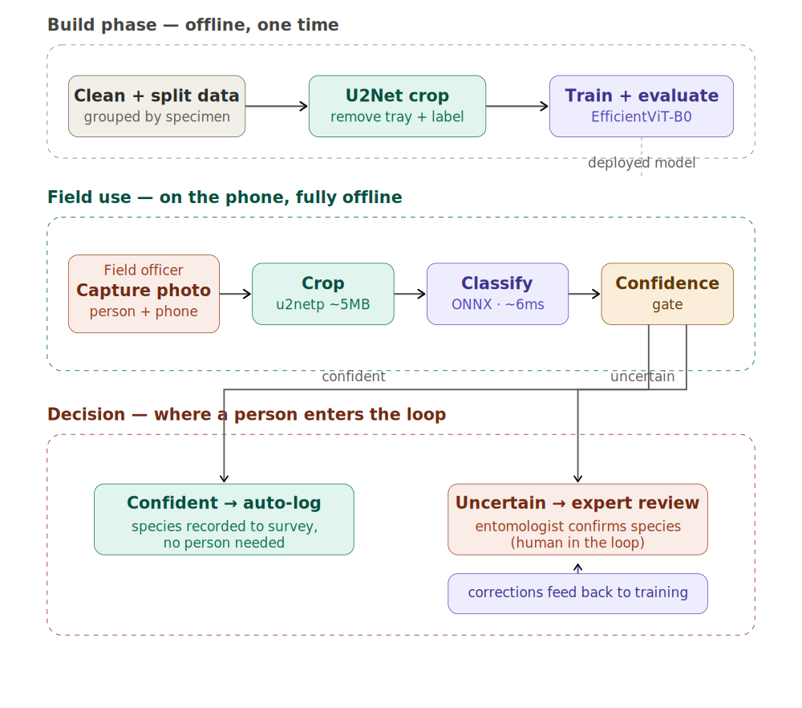

# VectorCam Mosquito Classifier — Field Evaluation and Go/No-Go

**Vishwanath Ninganolla** · Assistant Research Engineer assessment · July 2026

> **A note on the numbers:** every performance figure in this document is a **macro-F1 score** unless I state otherwise. F1 blends precision (few false alarms) and recall (few missed cases) into one number from 0 to 1; "macro" means I average it across all three species equally, so the model can't hide a failure on the rare, important species behind success on the common one. A fuller plain-English guide to the metrics is in the [README](README.md#2-a-one-minute-guide-to-the-metrics-read-this-first).

---

## My call: no-go this quarter. The model isn't the problem — missing field data is, and it's fixable.

**The number I stake it on: a macro-F1 of 0.65 on Kenya field photos the model has never seen.**

Trained on lab data, the model looks excellent *in the lab* — a macro-F1 of about 0.99. But that score does not survive the real world. On genuine Kenya field photos it falls to a **macro-F1 of 0.648**, and it fails in the worst possible place: it cannot reliably tell the two *Anopheles* species apart. Their individual F1 scores on Kenya are **0.56 for *An. gambiae*** and **0.49 for *An. stephensi*** — meaning the model identifies the invasive stephensi barely better than a coin flip. Since spotting invasive *An. stephensi* hidden among *An. gambiae* is the entire purpose of the program, that is not a model I would deploy.

So it's a no-go — but a confident one, because I know *why* and I know the fix. The gap is not the model. It is missing field data. When I add even a small amount of Kenya data to training, the field macro-F1 jumps by **+0.31**, and all three species clear an F1 of 0.95. The path to "go" is a specific, targeted collection effort, laid out at the end.

---

## How I measured it, and why I trust the number

**The tempting shortcut I didn't take.** The easy way to post a big number is to throw all the data — lab and Kenya — into one pile and split it randomly. Do that and you get a macro-F1 around 0.95. But it's misleading: it drops Kenya photos into training and then tests on photos the model has effectively already seen. It answers "can you re-recognize something familiar?" when the real question is "will you work in Kenya?" I set that split aside.

**The split I actually used.** Train on lab data (drops 0610 + 0618). Then test on data the model never touched, in two steps:

| Test set | Images / specimens | What it asks | Macro-F1 |
|---|---|---|---|
| **Test A — 0623 (new phones)** | 422 / 62 | does it survive an unseen device? | **0.92** |
| **Test B — Kenya field** | 753 / 461 | does it survive the field? | **0.65** |

For reference, the training side used **3,434 images (134 specimens)** for training and **870 images (34 specimens)** held out for validation, all drawn from the lab drops 0610 and 0618. Full counts are in the [README](README.md#4-the-dataset).

Lab → Kenya is not an arbitrary choice — it *is* the deployment: a lab-built model meeting the field cold. That is why I report the 0.65 and not the 0.95. One is the truth about deployment; the other is a story told with leaked data.

**Keeping it honest under the hood.** Every split is grouped by `SpecimenID`, never by individual photo. Each lab specimen appears in ~20 near-identical photos; splitting by photo would leak near-duplicates across training and testing and quietly inflate the score. A hard assertion stops the run if a single specimen ever lands in two splits.

**Why macro-F1, not accuracy.** Kenya is about two-thirds *An. gambiae*. A lazy model that always answers "gambiae" would score well on plain accuracy while being useless. Macro-F1 weights all three species equally and punishes both false alarms and missed cases — exactly the pressure you want when the job is catching a rare invasive.

**I cleaned the data before I trusted it.** Ten specimens had photos labelled as more than one species. Six (in 0618, at ~29-to-1 ratios) were stray-frame mistakes — I fixed those by majority vote. Four (in 0623) were genuine ID collisions, the same ID reused across sessions — I dropped those, because a guess would be worse than a gap. Unlabelled photos were dropped, not invented. What remains has zero species-spanning specimens: 5,479 images, 691 specimens.

---

## The three things that decided my confidence

**1. It's the data, not the model — checked six ways.** I trained six architectures from 1.5M to 46M parameters (MobileNetV3, EfficientNet-B0 at two resolutions, EfficientViT-B0/B3, ConvNeXt-nano). Every one landed on Kenya between a macro-F1 of 0.64 and 0.76. The *biggest* model did *worse*, not better. A pure CNN didn't beat the hybrid. When 30× more capacity and four different design families all pile up at the same wall, the wall is the data — no architecture thinks its way past missing information.

**2. I ruled out the cheap explanations first.** Grad-CAM (a tool that shows which pixels the model used to decide) caught the early model looking at the *tray*, not the mosquito — a classic background shortcut. So I cropped the tray out with U2Net segmentation and retrained. Performance on unseen phones improved (0.89 → 0.92), and Grad-CAM confirmed the model was now genuinely looking at the specimen. **But Kenya still didn't move — stuck near 0.65.** That was the tell: the background shortcut was real, but it wasn't what broke field performance. (I also tested and dismissed a "fresh vs dried" shortcut theory.) The gap lives in the field specimens themselves.

**3. The root cause is a condition reversal.** Break the data down by specimen condition and the problem jumps out. For *every single species*, the condition it trained on is the opposite of the condition it meets in Kenya:

| Species | Trained on | Tested on (Kenya) |
|---|---|---|
| *Ae. aegypti* | ~100% fresh | ~100% dried |
| *An. stephensi* | ~100% fresh | ~100% dried |
| *An. gambiae* | mostly dried | ~100% fresh |

The model is always graded on the version of each species it saw *least*. That is exactly why *An. stephensi* is the worst class — there are **zero dried stephensi in training**, and every Kenya stephensi is dried. Inspecting the images adds the second half of the story. The Kenya field specimens are physically in worse shape than the lab ones: many are **squished with the body folded over rather than spread out**, so the legs and abdomen are bunched together instead of laid flat; some have **body parts that aren't intact**; and a number are simply **blurry**. Because the mosquito isn't spread open, the wings — where the fine differences between the two *Anopheles* live — are frequently folded under, obscured, or damaged. A lab specimen is posed and pristine; a field specimen is whatever survived the trap and the handling. So the field gap is condition reversal plus real image-quality loss. Both are coverage problems, and both are fixable by collecting the right images.

**A telling detail — even the "control" species fails.** *An. gambiae* is the one species that trained on **both** fresh and dried, and Kenya tests it on fresh — a condition it *did* see in training. If the condition reversal were the whole story, gambiae should do fine. Yet its Kenya F1 is still only **0.56**. That is the clincher: it means the field gap is not *only* about fresh vs dried. Even with the right condition covered, a different environment — different phones, backgrounds, specimen handling, and image quality in Kenya versus the lab — still drags performance down. This is why the fix is not just "cover both conditions" but "train on real field data, and always keep a separate, held-out field test set to measure honestly." Condition coverage is necessary; field data is what actually closes the gap.

---

## The proof that data closes it

The experiment that turns "I think it's the data" into "it's the data." Split Kenya in half by specimen (grouped, balanced by species, no leakage). Add one half to training. Test on the other half — specimens the model never saw.

| Trained on | Kenya macro-F1 (held-out half) |
|---|---|
| Lab only | **0.648** |
| Lab + ~230 Kenya specimens | **0.955** |
| **Improvement** | **+0.31** |

*An. stephensi* goes from an F1 of **0.49 to 0.95**; *An. gambiae* from **0.56 to 0.96** — the exact confusion blocking deployment, resolved by showing the model the field conditions it was missing. I ran it three times on different splits; the improvement held every time (+0.20, +0.29, +0.27).

**Where I keep myself honest:** that 0.955 is optimistic. The Kenya half I trained on and the half I tested on came from the same collection sessions, so they share conditions a genuinely new deployment wouldn't. So I don't sell 0.955 as a production number — I sell the **+0.31 improvement**, which is the robust, repeatable finding. Field data helps, and a lot. The exact deployable number needs more varied field data to pin down — which is precisely what the collection ask is for.

---

## The model I'd ship, and whether it fits a phone

**EfficientViT-B0**, trained on segmented crops: **8.5 MB, ~6 ms per image**. Small and fast enough for the low-end phones field teams already carry. MobileNetV3 (6 MB) is my fallback if a target phone handles plain CNN operations better than the newer model's. The classifier runs fully offline. The one catch: the crop step must also run on the phone and must match the training crop — for a low-connectivity phone that means a lightweight on-device segmenter (u2netp, ~5 MB) or leaning on the app's capture framing.

I built a working on-device demo to prove the edge story isn't hypothetical: a browser app ([live here](https://523vishwanath.github.io/vectorid-ondevice/)) running the model via ONNX Runtime Web, fully offline after first load and installable as an app, with low-confidence and low-margin predictions declined rather than forced — because the model has no "not a mosquito" class, and pretending otherwise in the field would be dangerous.

**One picture of the whole flow** — capture to prediction, where the computing happens, and where a person steps in:

A field officer takes the photo (person, in the field), the phone crops and classifies it, and a confidence gate decides: confident results are logged automatically, while uncertain ones go to a human entomologist for review — and those corrections feed back into future training.

---

## What I'd do next

**On the modelling side:**
1. Put a lightweight segmenter (u2netp) on-device so the inference crop matches the training crop — closing the gap the demo currently papers over with a simple resize.
2. Add a real abstention path: the confidence-and-margin gate (already in the demo) now, and a proper "not a mosquito" class once negative data exists.
3. When field data arrives, retrain on a split that includes every species in both fresh and dried conditions — but grade it on a **held-out future field batch**, so the number stays honest.

**What I'd ask the Kenya team to collect (~2,000 images).** Spend them on the holes, not evenly:
- **~35% fresh field *An. stephensi*** — the invasive target, and we have **zero fresh stephensi** right now.
- **~40% fresh field *An. gambiae*** — the dominant field species and the hardest fresh case.
- **~15% fresh field *Ae. aegypti*** — Aedes only *looks* easy today because every Aedes we have is one condition; the other condition will fail exactly like stephensi does now. Collect it before it surprises us in production.
- **~10% dried controls** across species.

And two capture-quality asks, because image quality is half the gap: shoot the **same specimen on multiple phones** (so the model learns the mosquito, not the camera), take **more angles per specimen** (Kenya averages ~1.6 shots vs ~20 in the lab), and handle specimens gently enough that the wings survive. Anything too damaged or blurry to read should go to a human, not get a forced guess.

---

**Environment.** Training ran on an NVIDIA RTX 5090 (RunPod), with Google Colab for data prep and export. Core stack: Python 3.11, PyTorch 2.x, timm, ONNX / ONNX Runtime Web, scikit-learn, and Comet ML for tracking. The full pinned list is in `scripts/requirements.txt`.

*Everything here reproduces: the repo has the full pipeline (prep → train → evaluate), both checkpoints (lab-only and lab+Kenya), the exact Kenya split files, and the run logs. Detail on the dataset, training setup, experiment tracking, error analysis, and the app is in the [README](README.md).*
